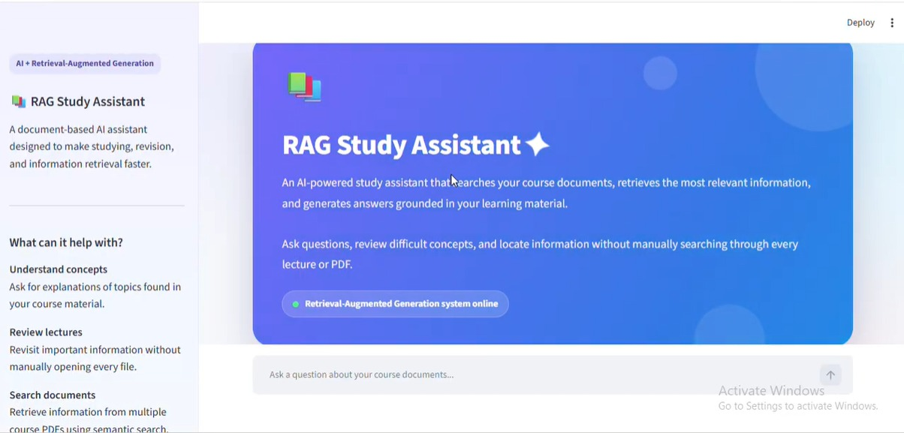
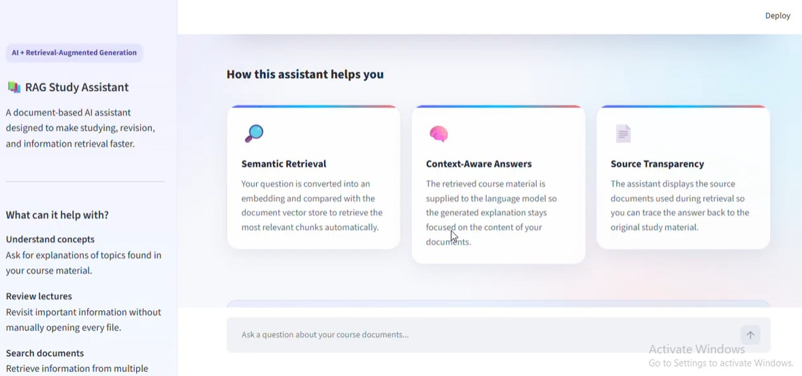
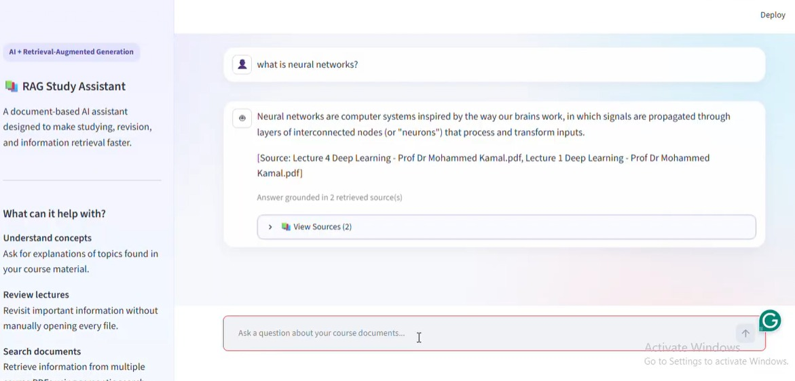
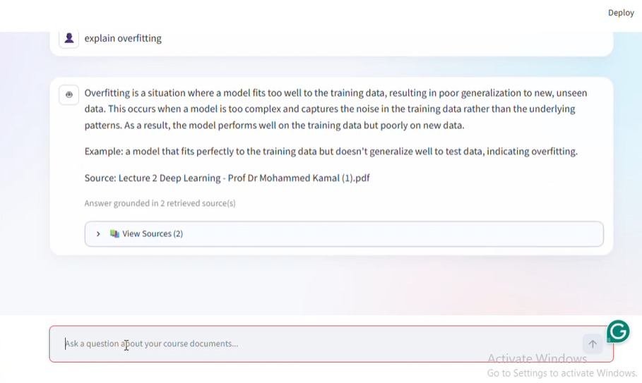
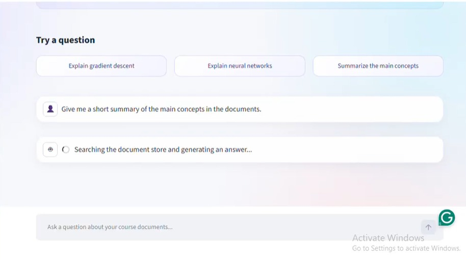

# Deep Learning RAG Study Assistant

A full-stack **Retrieval-Augmented Generation (RAG)** application that lets students ask questions about Deep Learning course material and get **grounded answers with source citations** — no hallucinated explanations, only what's actually in the lecture documents.

The system retrieves semantically relevant chunks from a persisted **ChromaDB** vector store, generates answers with a local **Llama 3.2** model through **Ollama**, exposes the pipeline through a **FastAPI** backend, and serves it through an interactive **Streamlit** chat interface.

---

## Table of Contents

- [Features](#features)
- [Architecture](#architecture)
- [Tech Stack](#tech-stack)
- [Project Structure](#project-structure)
- [Knowledge Base](#knowledge-base)
- [Getting Started](#getting-started)
- [Backend Setup](#backend-setup)
- [Frontend Setup](#frontend-setup)
- [API Reference](#api-reference)
- [How Retrieval Works](#how-retrieval-works)
- [RAG Evaluation](#rag-evaluation)
- [Testing](#testing)
- [Docker](#docker)
- [Environment Variables](#environment-variables)
- [Screenshots](#screenshots)
- [Future Improvements](#future-improvements)
- [Contributors](#contributors)
- [License](#license)

---

## Features

- Semantic search across Deep Learning lecture documents
- Retrieval-Augmented Generation using a local LLM (no external API calls, fully offline-capable)
- Sentence-transformer embeddings with `all-MiniLM-L6-v2`
- Persistent ChromaDB vector store — no rebuilding at request time
- Source-aware answers citing the exact lecture filenames used
- FastAPI REST backend with typed request/response schemas
- Interactive Streamlit chat interface with source expanders
- Prompt grounding that explicitly refuses to answer from outside knowledge
- Backend loads the embedding model and vector database once at startup (FastAPI lifespan)
- Fully configurable frontend/backend communication through environment variables
- Automated backend tests covering both the happy path and invalid input

---

## Architecture

```text
                     ┌─────────────────────┐
                     │        User          │
                     └──────────┬───────────┘
                                │
                                ▼
                   ┌───────────────────────────┐
                   │   Streamlit Frontend        │
                   │   (chat UI, source display) │
                   └──────────┬───────────────────┘
                                │  POST /query
                                ▼
                   ┌───────────────────────────┐
                   │      FastAPI Backend        │
                   └──────────┬───────────────────┘
                                │
              ┌─────────────────┴─────────────────┐
              ▼                                     ▼
   ┌───────────────────────┐          ┌─────────────────────────┐
   │  SentenceTransformer    │          │      ChromaDB              │
   │  (embed the question)   │ ───────▶ │  (Top-K semantic search)   │
   └───────────────────────┘          └──────────────┬──────────────┘
                                                          │ retrieved chunks
                                                          ▼
                                            ┌───────────────────────┐
                                            │   Grounded Prompt        │
                                            │ (context + question)     │
                                            └──────────────┬────────────┘
                                                          ▼
                                            ┌───────────────────────┐
                                            │  Ollama + Llama 3.2      │
                                            └──────────────┬────────────┘
                                                          ▼
                                            ┌───────────────────────┐
                                            │   Answer + Sources        │
                                            └──────────────┬────────────┘
                                                          ▼
                                              back to Streamlit UI
```

**RAG flow, end to end:**

```text
Question → Embedding → Retrieval → Grounded Context → Ollama → Answer + Sources
```

---

## Tech Stack

| Component | Technology |
|---|---|
| Language | Python |
| LLM | Llama 3.2 |
| Local LLM Runtime | Ollama |
| Embeddings | SentenceTransformers |
| Embedding Model | `all-MiniLM-L6-v2` |
| Vector Database | ChromaDB |
| Backend | FastAPI |
| Frontend | Streamlit |
| API Client | Requests |
| Configuration | python-dotenv |
| Testing | Pytest / HTTPX / FastAPI TestClient |
| Containerization | Docker |

---

## Project Structure

```text
ITI_Rag_Assist_ForDeepLearning-main/
│
├── backend/
│   ├── app/
│   │   ├── api/
│   │   │   └── routes/
│   │   │       └── query.py          # GET /health, POST /query
│   │   ├── core/
│   │   │   └── config.py             # Settings loaded from .env + vector store config.json
│   │   ├── schemas/
│   │   │   └── query.py              # QueryRequest / QueryResponse
│   │   ├── services/
│   │   │   ├── generation.py         # Builds grounded prompt, calls Ollama
│   │   │   └── retrieval.py          # Loads ChromaDB, embeds queries, retrieves chunks
│   │   ├── utils/
│   │   │   └── logging_config.py
│   │   └── main.py                   # FastAPI app, CORS, lifespan startup/shutdown
│   │
│   ├── data/
│   │   └── vector_store/             # Persisted ChromaDB collection, produced by the notebook
│   │       ├── chroma.sqlite3
│   │       ├── config.json
│   │       └── ...
│   │
│   ├── tests/
│   │   └── test_query.py             # Happy-path + invalid-input (422) tests
│   │
│   ├── .env.example
│   ├── Dockerfile
│   └── requirements.txt
│
├── frontend/
│   ├── app.py                        # Streamlit chat UI
│   ├── api_client.py                 # Thin wrapper around the backend API
│   ├── .env.example
│   └── requirements.txt
│
├── notebooks/
│   └── rag_pipeline_FINAL.ipynb            # Data loading, chunking, embeddings, retrieval, evaluation
│
├── docs/
│   └── images/                       # Screenshots referenced below
│
├── pipeline_config.json
└── .gitignore
```

---

## Knowledge Base

The assistant is built around **Deep Learning lecture material** (PDF slide decks).

During preprocessing, the documents are:

1. Parsed from PDF
2. Split into overlapping text chunks
3. Converted into embeddings
4. Stored in ChromaDB
5. Retrieved semantically whenever a user asks a question

Current RAG configuration (persisted alongside the vector store so retrieval settings never drift out of sync with how the store was built):

```json
{
  "chunk_size": 800,
  "chunk_overlap": 150,
  "embedding_model": "all-MiniLM-L6-v2",
  "ollama_model": "llama3.2",
  "collection_name": "docs"
}
```

The backend reads this directly from:

```text
backend/data/vector_store/config.json
```

---

## Getting Started

### 1. Prerequisites

Install:

- Python 3.10+
- Git
- Ollama

Verify:

```bash
python --version
git --version
ollama --version
```

### 2. Clone the Repository

```bash
git clone <https://github.com/SaraAyman-240/ITI_Rag_Assist_ForDeepLearning.git>
cd ITI_Rag_Assist_ForDeepLearning-main
```

### 3. Create a Virtual Environment

**Windows**

```bash
python -m venv .venv
.venv\Scripts\activate
```

**macOS / Linux**

```bash
python3 -m venv .venv
source .venv/bin/activate
```

### 4. Set Up Ollama

Pull the model used by this project:

```bash
ollama pull llama3.2
```

Make sure Ollama is running before starting the backend:

```bash
ollama serve
```

The exact model name is read from `backend/data/vector_store/config.json`, so if you swap models, update that file (and re-pull the new model) rather than hardcoding it anywhere in the backend code.

---

## Backend Setup

```bash
cd backend
pip install -r requirements.txt
```

Create your local `.env` from the example:

```bash
# macOS / Linux
cp .env.example .env

# Windows
copy .env.example .env
```

Example configuration:

```env
TOP_K=3
FRONTEND_ORIGIN=http://localhost:8501
```

Start the backend:

```bash
uvicorn app.main:app --reload
```

- API base URL: `http://127.0.0.1:8000`
- Interactive Swagger docs: `http://127.0.0.1:8000/docs`

---

## Frontend Setup

Open a second terminal:

```bash
cd frontend
pip install -r requirements.txt
```

Create `frontend/.env` from the example:

```bash
cp .env.example .env      # macOS / Linux
copy .env.example .env    # Windows
```

```env
API_BASE_URL=http://127.0.0.1:8000
```

Start Streamlit:

```bash
streamlit run app.py
```

Then open `http://localhost:8501`.

With both the backend and frontend running (and Ollama serving `llama3.2` in the background), ask a real question in the chat box — you should see a grounded answer plus the lecture filenames it was drawn from.

---

## API Reference

### Health Check

```http
GET /health
```

Example response:

```json
{
  "status": "ok",
  "collection": "docs",
  "chunks": 123
}
```

The exact chunk count depends on the persisted vector store you're running against.

### Ask a Question

```http
POST /query
```

Request body:

```json
{
  "question": "What is stochastic gradient descent?"
}
```

Example response:

```json
{
  "answer": "Stochastic gradient descent is ...",
  "sources": [
    "Lecture 7 Deep Learning - Prof Dr Mohammed Kamal.pdf"
  ]
}
```

An empty or missing `question` field returns HTTP `422` with a validation error body.

### cURL Example

```bash
curl -X POST "http://127.0.0.1:8000/query" \
  -H "Content-Type: application/json" \
  -d '{"question": "What is backpropagation?"}'
```

---

## How Retrieval Works

1. `SentenceTransformer` converts the user's question into an embedding.
2. ChromaDB performs a semantic similarity search over the persisted collection.
3. The backend retrieves the Top-K most relevant chunks (`TOP_K` in `.env`, default `3`).
4. Retrieved text and source metadata are inserted into a grounded prompt.
5. The prompt is sent to `llama3.2` through Ollama.
6. The model is explicitly instructed to answer **only from the retrieved context**.
7. The API returns both the generated answer and the unique source filenames used.

The generation prompt tells the model to:

- never use outside/general knowledge
- say it doesn't know when the answer isn't in the retrieved context
- cite only source filenames actually present in that context
- never invent page numbers, section numbers, or citation details

---

## RAG Evaluation

The pipeline was evaluated in `notebooks/rag_pipeline.ipynb` against 10 questions drawn from the Deep Learning lecture domain:

| # | Question | Correct? |
|---|---|---|
| 1 | What is gradient descent? | ✅ |
| 2 | What is stochastic gradient descent? | ✅ |
| 3 | What is Adam optimization? | ✅ (correctly declined — not covered in the retrieved context) |
| 4 | What is backpropagation? | ✅ |
| 5 | What is the purpose of the forward pass? | ✅ |
| 6 | What is the purpose of the backward pass? | ✅ |
| 7 | What is the vanishing gradient problem? | ✅ |
| 8 | What is the exploding gradient problem? | ✅ |
| 9 | What is He initialization? | ❌ (retrieval miss) |
| 10 | Why is parameter initialization important in neural networks? | ✅ |

**Result: 9/10 (90%) accuracy.**

**Failure analysis:** the one miss ("What is He initialization?") was a retrieval failure, not a hallucination — the relevant chunk either wasn't extracted cleanly from the source PDF or wasn't ranked highly enough for that query's embedding to be included in the Top-K results. Notably, the model responded with "I don't know" rather than inventing an answer, which is the correct, grounded failure mode for a RAG system.

**Mitigations applied / considered:**
- Increasing `TOP_K` so borderline-relevant chunks have a better chance of being included
- Re-checking whether the source slide's text extracted cleanly (equation-heavy slides can lose text with basic PDF parsing)
- Reducing chunk size / increasing overlap so initialization-related content isn't diluted inside a larger chunk

**Further improvement ideas:**
- Tune `TOP_K`
- Experiment with chunk size and overlap
- Add metadata-aware or hybrid keyword + vector retrieval
- Add a reranking step after initial retrieval
- Add page-level (not just filename-level) citations
- Expand to a larger, automated evaluation set

---

## Testing

Backend tests live in `backend/tests/test_query.py` and cover:

- `GET /health` returns the expected status/collection/chunk count
- `POST /query` happy path returns a grounded answer + sources
- `POST /query` with an empty question returns `422`
- `POST /query` with a missing field returns `422`

These tests run against the real `RetrievalService` and `GenerationService`, so before running them make sure:

- Ollama is running (`ollama serve`) with the `llama3.2` model pulled
- The persisted vector store exists at `backend/data/vector_store/`

Run them:

```bash
cd backend
pytest tests/ -v
```

Expected output: `4 passed`.

---

## Docker

A backend `Dockerfile` is included, based on `python:3.10-slim`.

```bash
cd backend
docker build -t rag-study-assistant-backend .
docker run -p 8000:8000 rag-study-assistant-backend
```

The container ships with the persisted vector store baked in (`data/vector_store/`), so no rebuild step is needed at runtime. It still needs network access to a running Ollama instance:

- **macOS / Windows (Docker Desktop):** Ollama running on the host is reachable at `host.docker.internal`
- **Linux:** run the container with `--network host`, or point it at a separate Ollama container/service

---

## Environment Variables

### Backend (`backend/.env`)

| Variable | Default | Description |
|---|---|---|
| `TOP_K` | `3` | Number of chunks retrieved per query |
| `FRONTEND_ORIGIN` | `http://localhost:8501` | Allowed frontend origin for CORS |

### Frontend (`frontend/.env`)

| Variable | Default | Description |
|---|---|---|
| `API_BASE_URL` | `http://127.0.0.1:8000` | FastAPI backend URL |

Never commit real `.env` files — only the `.env.example` templates are tracked in git.

---

## Screenshots

### Main Interface

The landing view — hero header, sidebar with usage tips and the RAG pipeline diagram, and the chat input.



### How the Assistant Helps

Feature cards summarizing semantic retrieval, context-aware answers, and source transparency.



### Generated Answer with Sources

A real query ("what is neural networks?") answered from the retrieved lecture chunks, with an expandable source list and a "grounded in N retrieved source(s)" indicator.



### Another Example — "explain overfitting"



### Suggested Questions + Loading State

One-click example questions, and the loading indicator shown while the backend retrieves context and generates an answer.



---

## Future Improvements

- Page-level (not just document-level) citations
- Retrieval reranking
- Automated RAG evaluation metrics (not just manual grading)
- Conversation-aware follow-up questions
- Document upload support directly from the UI
- Support for additional course domains
- Hybrid keyword + vector retrieval
- Full containerization of frontend + backend + Ollama as a single Docker Compose stack

---

## Contributors

 -Sara Ayman Abdel Moneim Zeitoun
 -Nouran Yasser ABdel-Samei Salama

---

## License

This project is intended for educational use.

If course lecture material is used as the knowledge base, ensure the source documents are used and distributed according to their applicable permissions and institutional policies.

---

## Summary

This project demonstrates a complete, local, end-to-end RAG workflow:

```text
Deep Learning PDFs
      ↓
Chunking + Embeddings
      ↓
ChromaDB
      ↓
Semantic Retrieval
      ↓
Grounded Prompt
      ↓
Llama 3.2 via Ollama
      ↓
FastAPI
      ↓
Streamlit
      ↓
Answer + Sources
```

The goal: a practical study assistant that retrieves relevant course material before generating an answer, making responses more grounded and traceable than a standalone LLM response — while staying honest about what it doesn't know.
